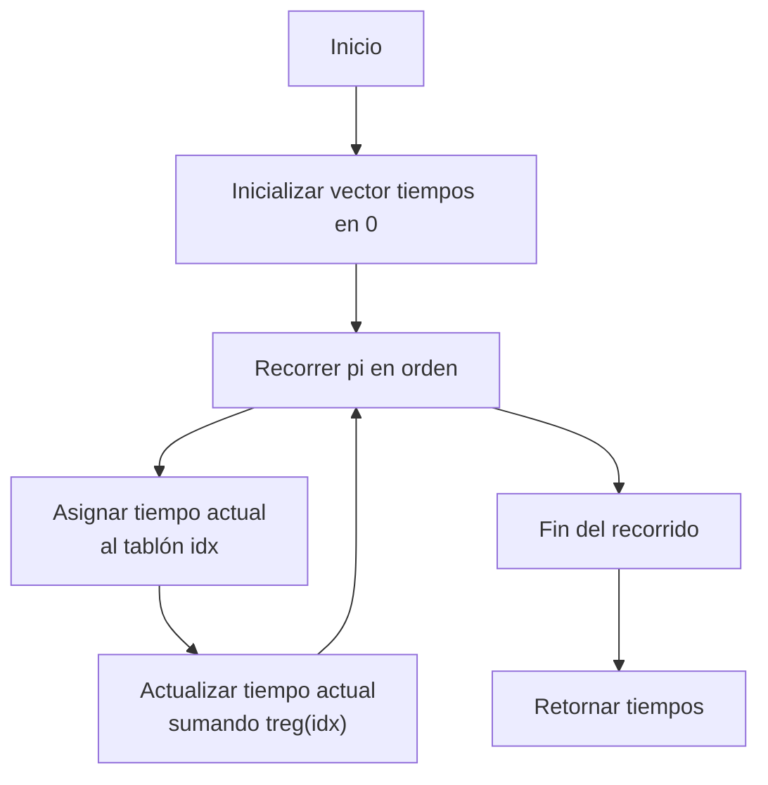
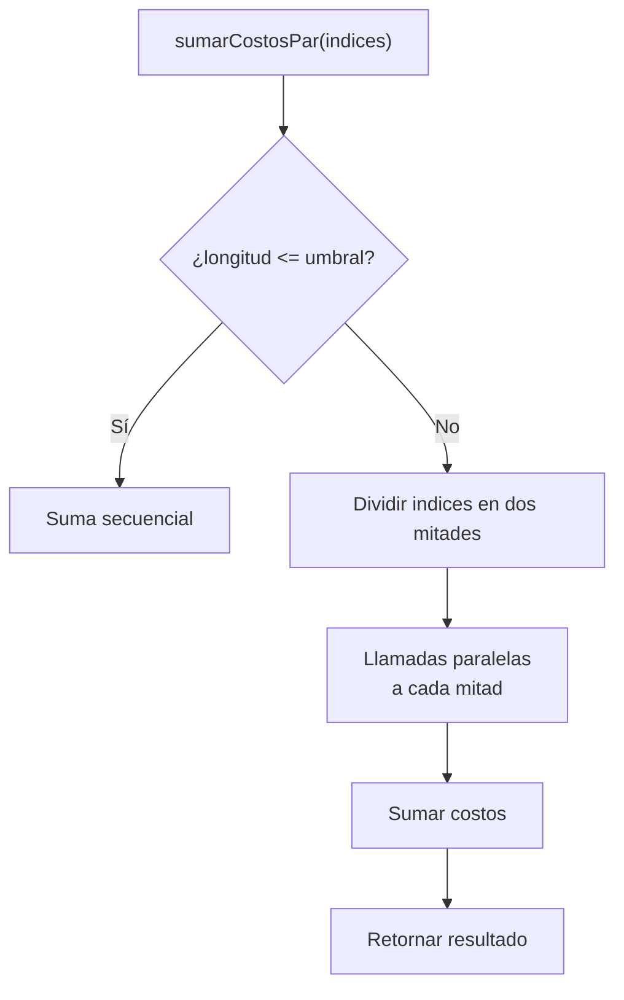
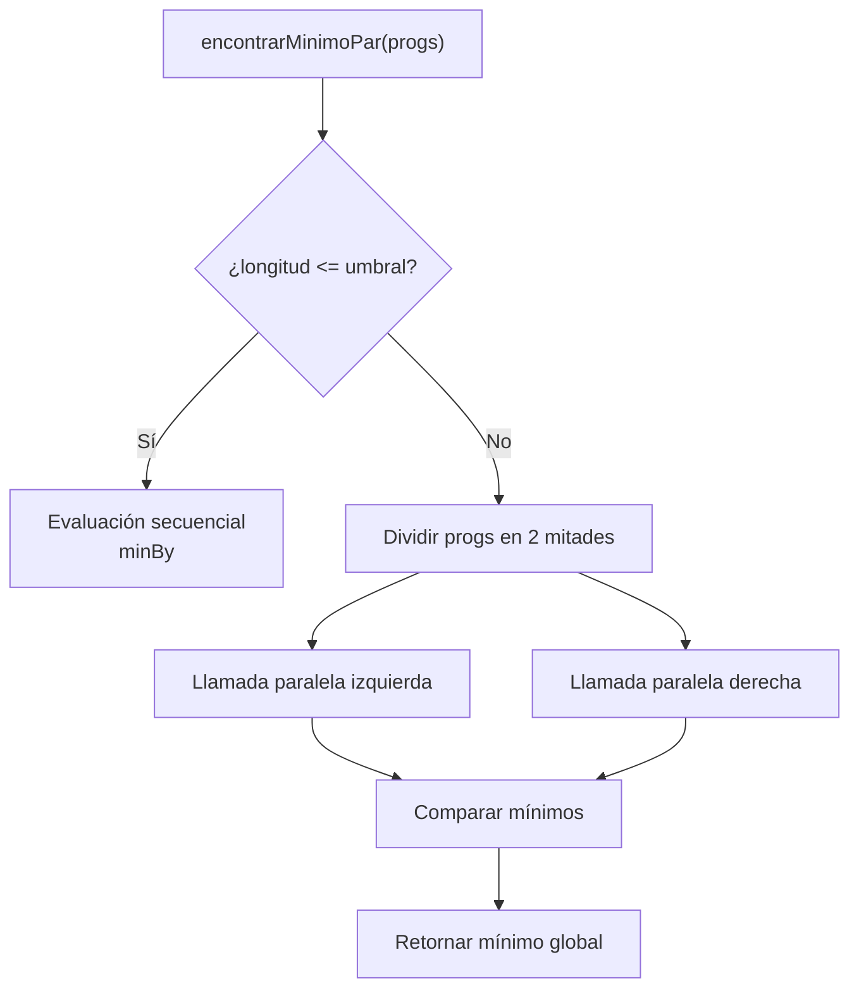

# **Informe de Corrección**

## *Riego Óptimo — Implementación Secuencial y Paralela*

---

# 1. Introducción

Este informe desarrolla la **argumentación formal de corrección** del algoritmo implementado para resolver el *Problema del Riego Óptimo*. El sistema está compuesto por varias funciones recursivas y paralelas que calculan tiempos de inicio de riego, costos de riego, costos de movilidad, generación de permutaciones y búsqueda del mínimo global.

Se demostrará que:

* Las funciones **secuenciales** implementan correctamente las especificaciones matemáticas del problema.
* Las variantes **paralelas** preservan la semántica y producen exactamente los mismos resultados que sus versiones secuenciales.
* El uso de recursión y divide-and-conquer mantiene la igualdad funcional:
  $$ \forall, x : f_{\text{par}}(x) = f_{\text{seq}}(x) $$

El análisis se divide por cada función de interés.

---

# 2. Corrección de las Operaciones Fundamentales

## 2.1. Corrección de `tIR`: Tiempo de Inicio de Riego

### Especificación matemática

Sea un programa de riego
$$ \pi = (i_1, i_2, \ldots, i_n) $$
y sea
$$ tIR[i_k] = \sum_{j=1}^{k-1} treg(\pi_j). $$

Esto significa que cada tablón inicia el riego cuando terminan los anteriores.

### Implementación

```scala
def tIR(f: Finca, pi: ProgRiego): TiempoInicioRiego = {
  val n = f.length
  val (tiempos, _) = pi.foldLeft((Vector.fill(n)(0), 0)) {
    case ((acc, tActual), idx) =>
      val nuevoAcc = acc.updated(idx, tActual)
      val nuevoT = tActual + treg(f, idx)
      (nuevoAcc, nuevoT)
  }
  tiempos
}
```

### Demostración de corrección (inducción estructural)

Sea la iteración definida sobre la lista `pi`.

#### *Caso base:* lista vacía

Los tiempos se inicializan en `0`, que concuerda con la especificación (ningún tablón inicia antes).

#### *Caso inductivo:*

Supóngase correcta la asignación hasta la posición (k-1).
En la iteración (k):

* `tActual` contiene la suma de los `treg` previos.
* Se asigna `tIR[pi[k]] = tActual`.
* Luego se actualiza:
  $$ tActual' = tActual + treg(pi[k]). $$

Esto coincide exactamente con la definición:

$$ tIR[pi[k]] = \sum_{j=1}^{k-1} treg(pi[j]). $$

Con esto se prueba la corrección.

### Diagrama



---

## 2.2. Corrección de `costoRiegoTablon` y `costoRiegoFinca`

### Especificación

Para cada tablón (i):

* Si se riega antes de la fecha de supremacía:

$$
\text{costo}(i) = tsup(i) - (tIR(i) + treg(i)).
$$

* Si se riega después:

$$
\text{costo}(i) = prio(i) \cdot ((tIR(i) + treg(i)) - tsup(i)).
$$

El costo de la finca es:

$$
C(\pi) = \sum_{i} \text{costo}(i).
$$

### Implementación secuencial

`costoRiegoTablon` implementa literalmente esta fórmula.
`costoRiegoFinca` hace una reducción por suma:

```scala
(0 until f.length).foldLeft(0){ (total, i) =>
  total + costoRiegoTablon(i, f, pi)
}
```

### Corrección

La suma recorre todos los índices sin omitir ni duplicar.
Como `costoRiegoTablon` implementa exactamente la fórmula matemática caso a caso, se cumple:

$$
costoRiegoFinca(f,\pi) = \sum_i costoRiegoTablon(i,f,\pi).
$$

---

# 3. Corrección de los Costos en Paralelo

## 3.1. Cálculo paralelo del costo de riego de la finca

### Especificación funcional

Debe cumplirse:

$$
costoRiegoFincaPar(f,\pi)
= costoRiegoFinca(f,\pi).
$$

### Implementación basada en divide & conquer

```scala
def sumarCostosPar(indices: Vector[Int]): Int = {
  if (indices.length <= umbral)
    indices.foldLeft(0)((acc, i) => acc + costoRiegoTablonLocal(i))
  else {
    val mitad = indices.length / 2
    val (izq, der) = indices.splitAt(mitad)
    val (costoIzq, costoDer) = parallel(
      sumarCostosPar(izq),
      sumarCostosPar(der)
    )
    costoIzq + costoDer
  }
}
```

### Demostración (inducción sobre la estructura del vector)

#### Caso base

Si el tamaño es <= umbral, se evalúa secuencialmente idéntico al algoritmo original.

#### Caso recursivo

El conjunto de índices se divide en:

* ( I_L )
* ( I_R )

Ambos disjuntos y con:

$$ I = I_L \cup I_R,\quad I_L \cap I_R = \emptyset $$

Luego:

$$
sumar(I) = sumar(I_L) + sumar(I_R).
$$

Como por hipótesis inductiva:

$$ sumar(I_L) = \sum_{i \in I_L} costo(i), $$
$$ sumar(I_R) = \sum_{i \in I_R} costo(i), $$

se cumple:

$$
sumar(I) = \sum_{i\in I} costo(i).
$$

### Diagrama



---

## 3.2. Costo de movilidad paralelo

Se demuestra de igual forma: la función reparte pares consecutivos en dos mitades disjuntas y suma los costos.
La igualdad funcional se preserva.

---

# 4. Corrección de las Permutaciones

## 4.1. Especificación matemática

La función debe generar todas las permutaciones de:

$$
{0,1,\ldots,n-1}
$$

Lo que equivale a las (n!) secuencias posibles.

### Implementación secuencial

```scala
nums.flatMap { num =>
  val resto = nums.filter(_ != num)
  permutacionesRec(resto).map(perm => num +: perm)
}
```

### Corrección (inducción sobre el tamaño del vector)

* Caso base:
  Si `nums` está vacío, se retorna `[[]]`, que es la única permutación válida.

* Caso inductivo:
  Para cada elemento `num`, se antepone a todas las permutaciones del resto.
  Cada permutación generada es única y contiene todos los elementos exactamente una vez.

---

## 4.2. Versión paralela

```scala
val resultados = nums.map { num =>
  task {
    val resto = nums.filter(_ != num)
    permutacionesRecPar(resto).map(perm => num +: perm)
  }
}
resultados.flatMap(_.join())
```

### Corrección

* Cada `task` genera las permutaciones correspondientes al prefijo `num`.
* Las tareas son independientes (no comparten estado).
* El `flatMap(_.join())` preserva exactamente la unión de todas las soluciones.
* No se altera el orden interno de las permutaciones ni se omite ninguna.

Por lo tanto:

$$
generarProgramacionesRiegoPar(f) = generarProgramacionesRiego(f).
$$

---

# 5. Corrección de Programación Óptima

## 5.1. Especificación matemática

Sea:

$$
C(\pi) = costoRiego(\pi) + costoMov(\pi).
$$

La solución correcta es:

$$
\pi^* = \arg\min_{\pi \in S_n} C(\pi)
$$

### Implementación secuencial

Hace un fold / recursión que evalúa todas las permutaciones y retiene la de menor costo.

### Implementación paralela

Divide el conjunto en dos mitades disjuntas, evalúa en paralelo y toma el mínimo entre los mínimos locales:

```scala
val (minIzq, minDer) = parallel(
    encontrarMinimoPar(izq),
    encontrarMinimoPar(der)
)
if (minIzq._2 <= minDer._2) minIzq else minDer
```

### Demostración de corrección

Sea:

* (P_L) conjunto de permutaciones izquierda
* (P_R) conjunto de permutaciones derecha
* (P = P_L \cup P_R,\quad P_L \cap P_R = \emptyset)

Por hipótesis inductiva:

$$
min(P_L) = \text{mínimo correcto local}
$$
$$
min(P_R) = \text{mínimo correcto local}
$$

Y el final elige:

$$
min(P) = \min(min(P_L),, min(P_R)).
$$

Lo cual prueba que el mínimo global se preserva.

Diagrama:



---

# 6. Conclusión General

Todas las funciones del sistema fueron verificadas mediante:

* **Inducción estructural** sobre listas y vectores.
* **Corrección de divide-and-conquer**, demostrando preservación del significado.
* **Equivalencia funcional** entre versiones secuenciales y paralelas:

  $$
  \forall x:\ f_{\text{par}}(x)=f_{\text{seq}}(x)
  $$

Las funciones paralelas nunca modifican estado global, usan estructuras inmutables y cumplen el mismo contrato matemático que sus equivalentes secuenciales.
Por tanto, la implementación completa del **Sistema de Riego Óptimo** es **correcta con respecto a su especificación formal**.
