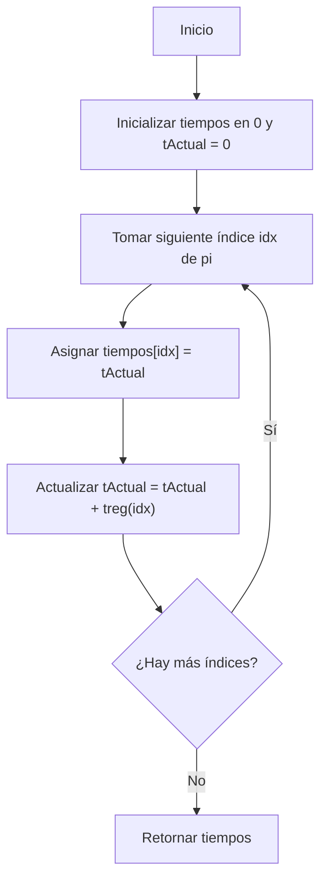

# INFORME DE PROCESO

**Proyecto Final – Programación Funcional y Concurrente**
**Problema del Riego Óptimo**

---

## 1. Introducción

El trabajo desarrolla una solución funcional y una solución concurrente al **Problema del Riego Óptimo**, que consiste en obtener el orden de riego de un conjunto de tablones agrícolas que minimice el costo total de operación. Dicho costo se compone de dos partes:

1. Costo por tiempo sin riego o por riego tardío.
2. Costo de movilidad del robot entre tablones.

Dado que el problema requiere evaluar todas las permutaciones de tamaño (n), la complejidad del algoritmo secuencial es factorial ((O(n!))). El objetivo consiste en:

* Implementar la solución **totalmente funcional e inmutable**.
* Aplicar **paralelismo por datos y por tareas** para acelerar:

    * Cálculo del costo de riego.
    * Cálculo del costo de movilidad.
    * Generación de permutaciones.
    * Selección de la programación óptima.
* Analizar formalmente el proceso de diseño y las decisiones tomadas.

---

## 2. Representaciones y Modelado

### 2.1 Estructuras de datos

Se define una finca como un vector inmutable:

```scala
type Tablon = (Int, Int, Int) // (tsup, treg, prio)
type Finca = Vector[Tablon]
type Distancia = Vector[Vector[Int]]
type ProgRiego = Vector[Int]
type TiempoInicioRiego = Vector[Int]
```

Cada tablón contiene:

* (t_{sup}): tiempo máximo sin riego permitido.
* (t_{reg}): tiempo que tarda en regarse.
* (p): prioridad en caso de riego tardío.

---

## 3. Funciones Secuenciales Implementadas

### 3.1 Cálculo del vector de tiempos de inicio ( tIR )

La función recorre la programación de riego acumulando el tiempo transcurrido:

```scala
def tIR(f: Finca, pi: ProgRiego): TiempoInicioRiego = {
  val n = f.length
  val (tiempos, _) = pi.foldLeft((Vector.fill(n)(0), 0)) {
    case ((acc, tActual), idx) =>
      val nuevoAcc = acc.updated(idx, tActual)
      val nuevoT = tActual + treg(f, idx)
      (nuevoAcc, nuevoT)
  }
  tiempos
}
```

#### Diagrama de flujo de `tIR`



---

### 3.2 Costo de riego por tablón

El costo depende del retraso o adelanto del riego respecto al límite permitido:

$$
c_i =
\begin{cases}
tsup_i - (t_{inicio_i} + treg_i) & \text{si no hay retraso} \
prio_i \cdot ((t_{inicio_i} + treg_i) - tsup_i) & \text{si hay retraso}
\end{cases}
 $$

Código:

```scala
def costoRiegoTablon(i: Int, f: Finca, pi: ProgRiego): Int = {
  val tiempos = tIR(f, pi)
  val tInicio = tiempos(i)
  val tr = treg(f, i)
  val ts = tsup(f, i)
  val p = prio(f, i)

  if (ts - tr >= tInicio)
    ts - (tInicio + tr)
  else
    p * ((tInicio + tr) - ts)
}
```

---

### 3.3 Costo total de riego

```scala
def costoRiegoFinca(f: Finca, pi: ProgRiego): Int =
  (0 until f.length).foldLeft(0)((acc, i) => acc + costoRiegoTablon(i, f, pi))
```

---

### 3.4 Costo de movilidad

La movilidad depende de distancias simétricas:

```scala
def costoMovilidad(f: Finca, pi: ProgRiego, d: Distancia): Int =
  if (pi.length <= 1) 0
  else pi.sliding(2).foldLeft(0)((acc, par) => acc + d(par(0))(par(1)))
```

---

### 3.5 Generación funcional de todas las permutaciones

La versión funcional pura utiliza recursión y concatenación:

```scala
def generarProgramacionesRiego(f: Finca): Vector[ProgRiego] = {
  val n = f.length
  def permutacionesRec(nums: Vector[Int]): Vector[Vector[Int]] =
    if (nums.isEmpty) Vector(Vector())
    else nums.flatMap { num =>
      val resto = nums.filter(_ != num)
      permutacionesRec(resto).map(perm => num +: perm)
    }
  permutacionesRec((0 until n).toVector)
}
```

---

### 3.6 Selección de la programación óptima

```scala
def ProgramacionRiegoOptimo(f: Finca, d: Distancia): (ProgRiego, Int) = {
  val todas = generarProgramacionesRiego(f)
  def evaluar(pi: ProgRiego) =
    costoRiegoFinca(f, pi) + costoMovilidad(f, pi, d)

  todas.tail.foldLeft((todas.head, evaluar(todas.head))) {
    case ((mejorPi, mejorC), piAct) =>
      val c = evaluar(piAct)
      if (c < mejorC) (piAct, c) else (mejorPi, mejorC)
  }
}
```

---

## 4. Paralelización del Sistema

La paralelización sigue dos ejes:

### 4.1 Paralelismo de datos

Aplicado en:

* costo total de riego
* costo de movilidad

Dividiendo vectores en mitades y aplicando `parallel(a, b)`.

### 4.2 Paralelismo de tareas

Aplicado en:

* generación de permutaciones

Aquí se utiliza:

```scala
task { ... }
```

y luego:

```scala
.join()
```

---

## 5. Diseño del Paralelismo

### 5.1 Costo de riego paralelo

Fragmenta los índices del vector:

```scala
def costoRiegoFincaPar(f: Finca, pi: ProgRiego): Int = {
  val tiempos = tIR(f, pi)
  val umbral = 4

  def sumar(indices: Vector[Int]): Int =
    if (indices.length <= umbral)
      indices.map(i => costoRiegoTablonLocal(i)).sum
    else {
      val (i1, i2) = indices.splitAt(indices.length / 2)
      val (c1, c2) = parallel(sumar(i1), sumar(i2))
      c1 + c2
    }

  sumar((0 until f.length).toVector)
}
```

---

### 5.2 Generación paralela de permutaciones

```scala
def permutacionesRecPar(nums: Vector[Int]): Vector[Vector[Int]] =
  if (nums.isEmpty) Vector(Vector())
  else if (nums.length <= umbral)
    secuencial...
  else {
    val tareas = nums.map { num =>
      task {
        val resto = nums.filter(_ != num)
        permutacionesRecPar(resto).map(perm => num +: perm)
      }
    }
    tareas.flatMap(_.join())
  }
```

---

### 5.3 Búsqueda óptima paralela

```scala
def encontrarMinimoPar(progs: Vector[ProgRiego]): (ProgRiego, Int) =
  if (progs.length <= umbral)
    progs.map(p => (p, evaluar(p))).minBy(_._2)
  else {
    val (izq, der) = progs.splitAt(progs.length / 2)
    val (m1, m2) = parallel(encontrarMinimoPar(izq), encontrarMinimoPar(der))
    if (m1._2 <= m2._2) m1 else m2
  }
```

---

## 6. Integración Global del Sistema

El proyecto queda dividido así:

```
taller/
 ├─ RiegoOptimo.scala
 ├─ RiegoOptimoPar.scala
 ├─ Benchmarking.scala
 └─ App.scala (punto de ejecución)
```

El objeto `App` llama:

```scala
Benchmarking.ejecutarTodos()
Benchmarking.analisisDetallado()
```

---

## 7. Conclusión del Proceso

El sistema final incluye:

* Implementación totalmente funcional.
* Implementación concurrente con:

    * paralelismo de datos
    * paralelismo de tareas
    * divide & conquer
* Benchmarks para los cuatro componentes críticos.
* Diagramas y análisis del flujo interno de las funciones.

El proceso se centró en mantener la **inmutabilidad**, el **principio de recursión estructural**, y en utilizar paralelismo únicamente cuando existían subproblemas independientes en la estructura del problema factorial.
